# Eyes On The Sky

A tablet-first educational game that puts Year 6 kids (ages 10–11) in the seat of a WAAF plotter during the Battle of Britain, walking the real Dowding System — radar, the Observer Corps, the Filter Room, Sector Stations and the squadrons themselves — as a hands-on plotting table instead of a slideshow.

Built with vanilla HTML/CSS/JavaScript and [Phaser 3](https://phaser.io/), with no runtime dependency on a CDN.

## Screenshots

**Intro** — title screen, character introductions, and the Dowding System walkthrough:

| 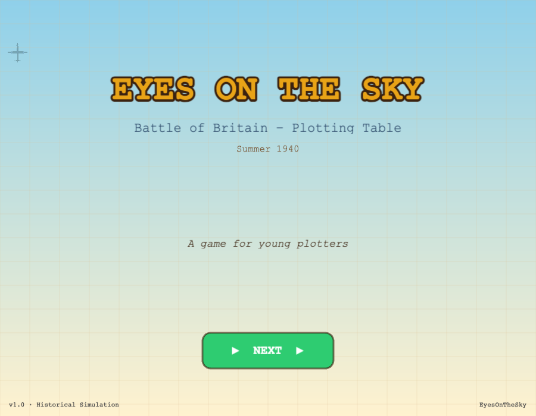 | 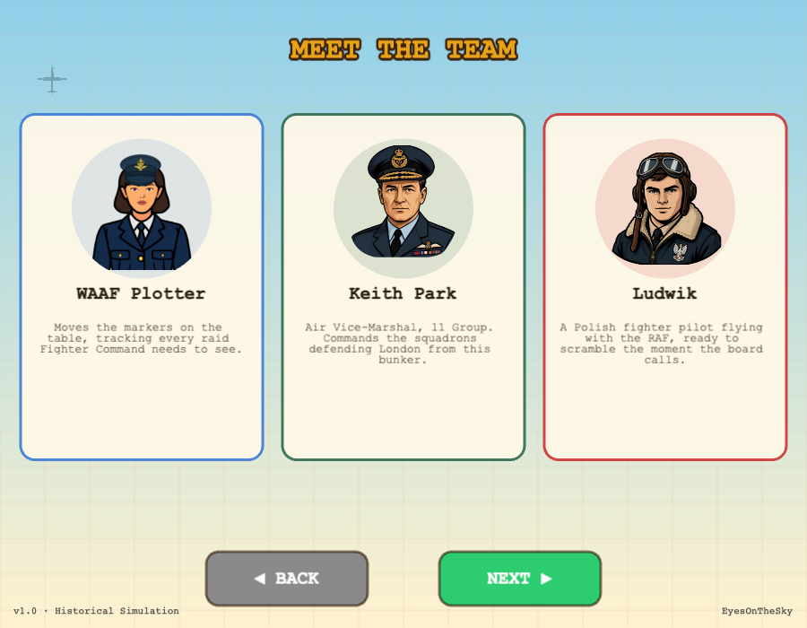 | 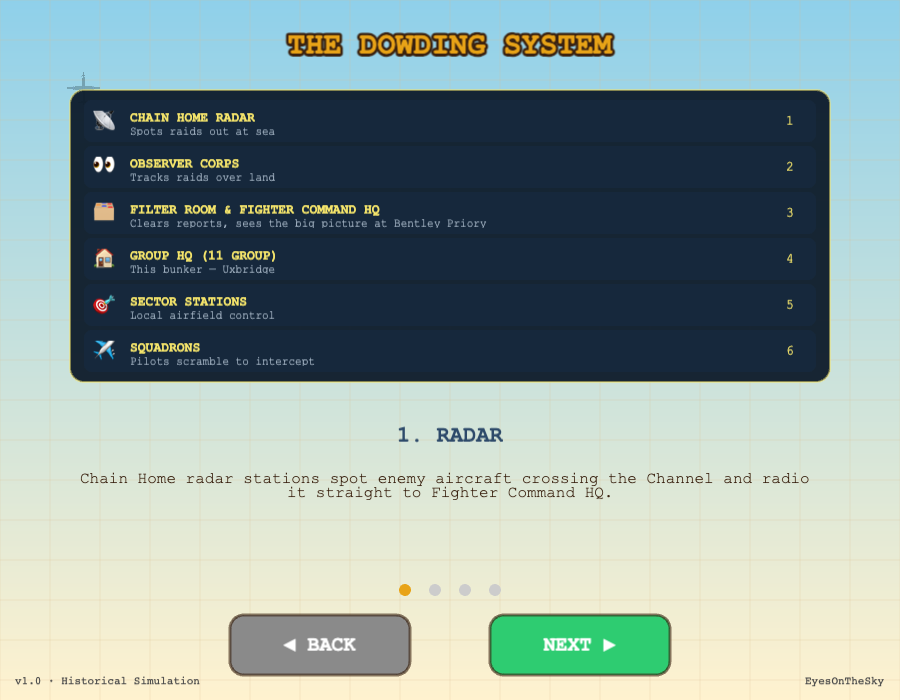 |
| :---: | :---: | :---: |

**Detection** — tapping radar blips out at sea, then Observer Corps posts once the raid crosses the coast:

| 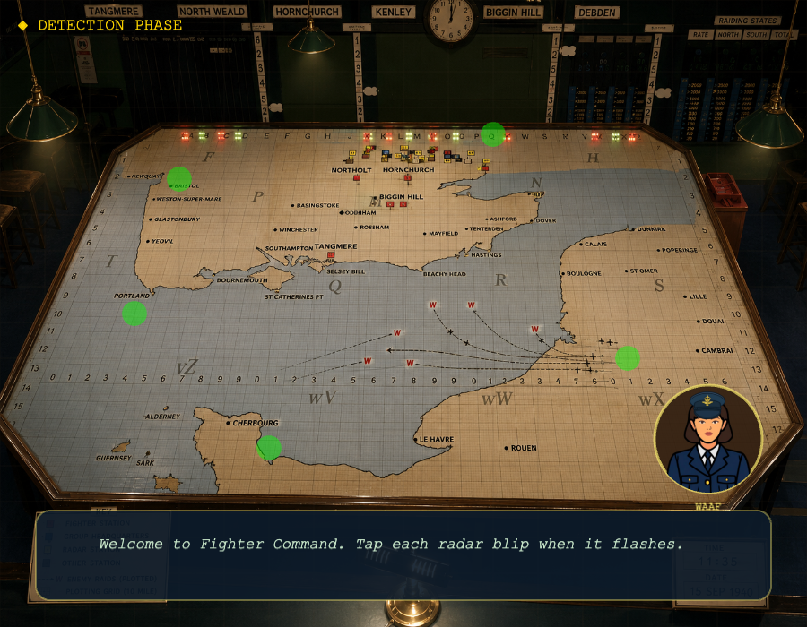 | 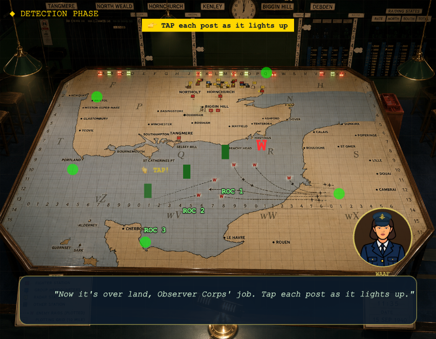 |
| :---: | :---: |

**Tote Board** — reading squadron state (Available / At Readiness / Left Ground) under a timer:

| 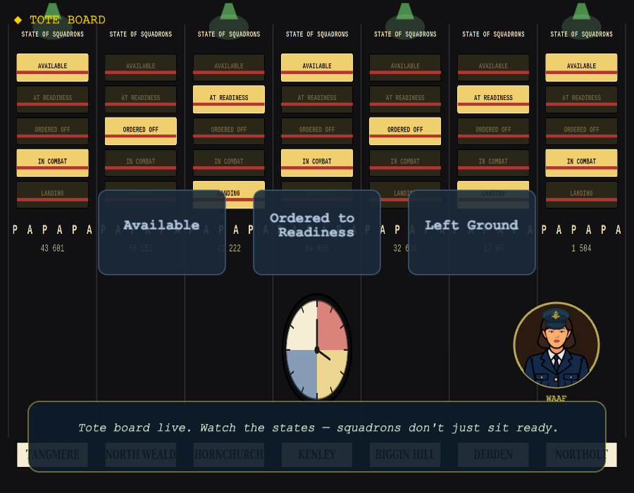 | 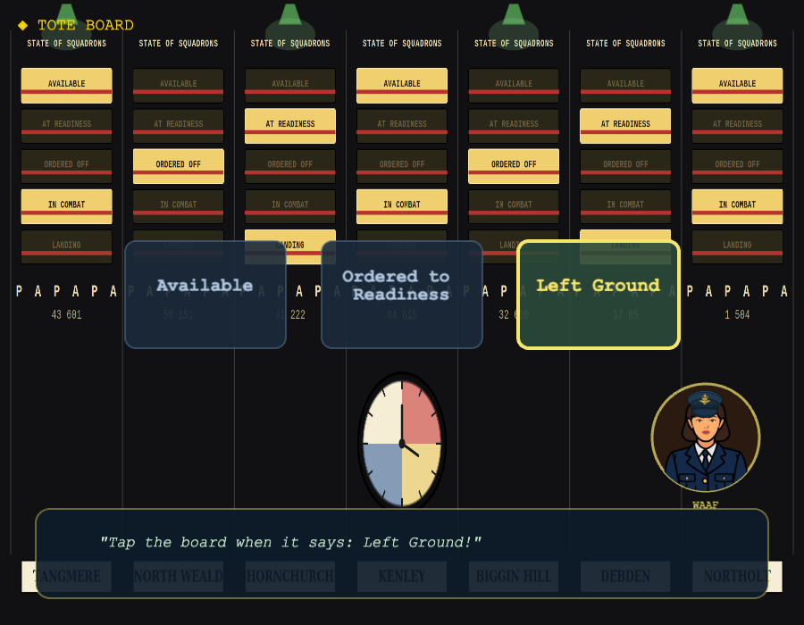 |
| :---: | :---: |

**Decision Room** — Keith Park's briefing, then dragging raid markers onto the correct Sector Station:

| 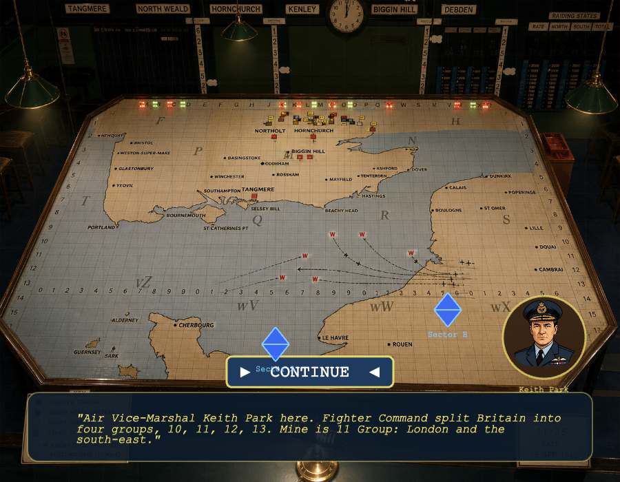 | 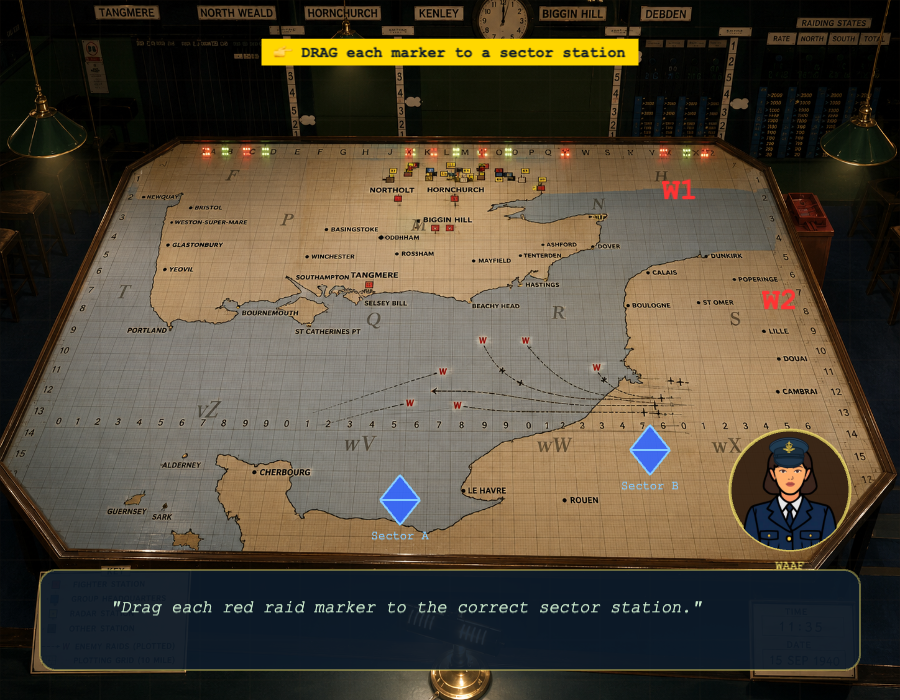 |
| :---: | :---: |

**Intercept** — Ludwik's squadron forming up and joining the escort:

| 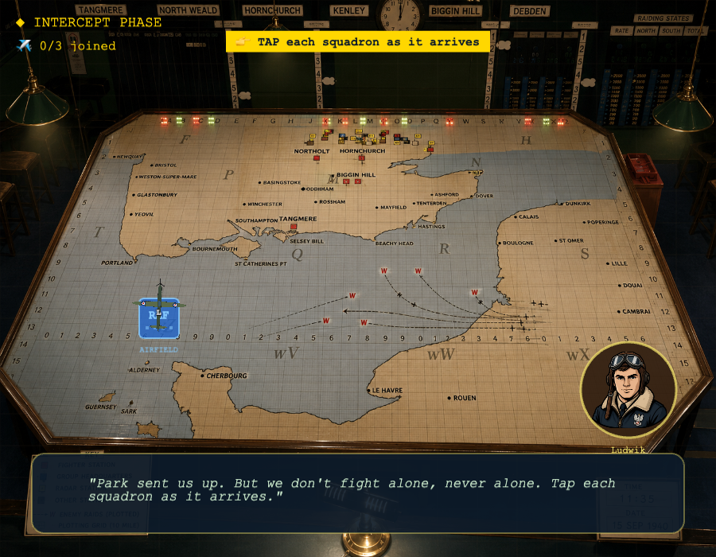 | 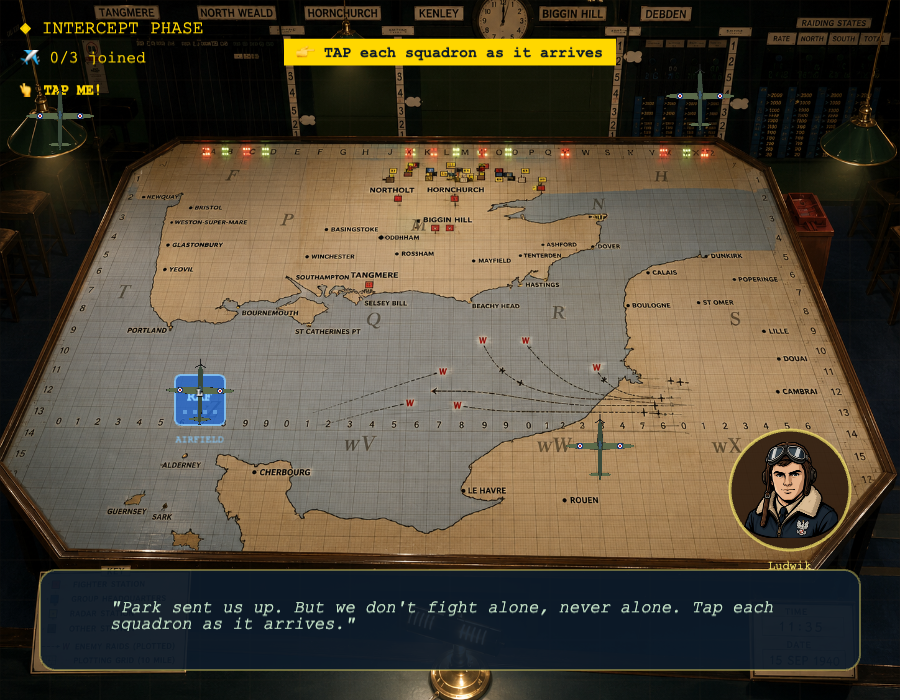 |
| :---: | :---: |

**Result** — the debrief screen, success and fail outcomes:

| 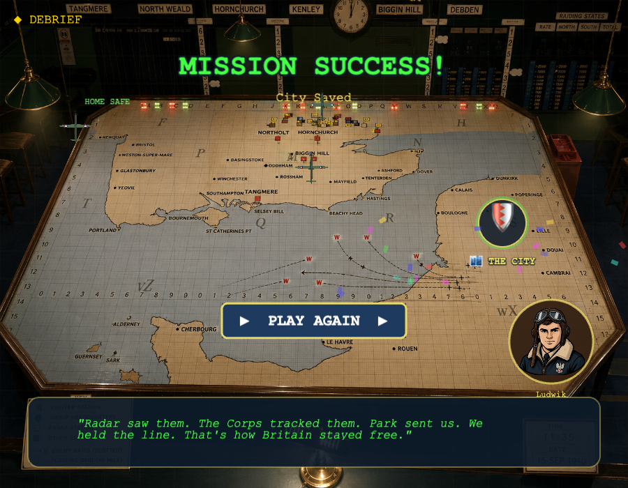 | 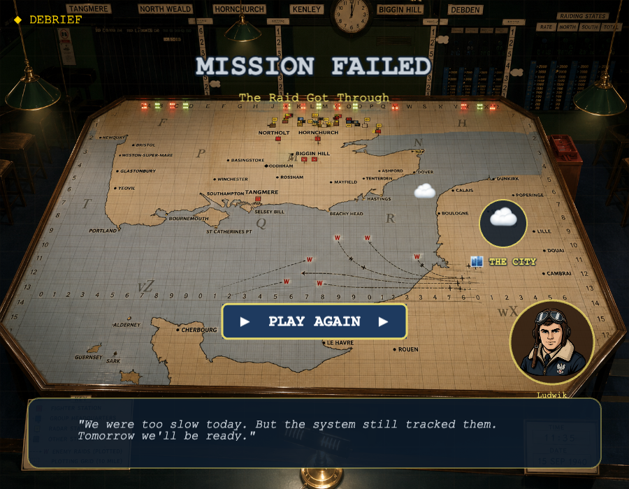 |
| :---: | :---: |

## Play it

Open `index.html` in a browser, or serve the folder with any static file server:

```bash
python3 -m http.server 8000
# then visit http://localhost:8000
```

No build step, no `npm install` — Phaser is vendored locally at `js/phaser.min.js`.

It's also installable: on Chrome/Android, "Add to Home Screen" turns it into a standalone app icon (see `manifest.json`), and a service worker (`sw.js`) caches everything it needs so it keeps working with no signal — handy for a classroom with an unreliable connection. Play through the whole game once while online first so every scene's assets get cached; after that it works fully offline.

## How it plays

The player moves through six scenes that mirror the real Dowding System chain of command, from first radar contact to the debrief:

1. **Intro** — title screen, a "Meet the Team" page introducing WAAF Plotter, Air Vice-Marshal Keith Park and Polish fighter pilot Ludwik, and a walkthrough of how the Dowding System's radar → Observer Corps → Filter Room → Sector Stations → squadrons chain fits together.
2. **Detection** — tap radar blips out at sea as Chain Home picks up an incoming raid, then track it inland as it's handed off to the Royal Observer Corps.
3. **Tote Board** — read the plotting board's state (Available / Readiness / Left Ground) and call it correctly under a timer, the way WAAF plotters actually worked the table.
4. **Decision Room** — drag raid markers onto the correct Sector Station so Keith Park's 11 Group can scramble the right squadrons.
5. **Intercept** — form up the squadron, escort it to the raid, and turn back the enemy formation before it reaches the city.
6. **Result** — a debrief screen (full success / partial success / fail) with Ludwik's closing line.

Every scene has voiced dialogue (WAAF, Keith Park, Ludwik, and a documentary-style narrator for the Dowding System explainer) plus sound effects, all routed through a central `AudioManager` so missing audio files degrade silently instead of erroring — the game keeps working while voice lines and art get filled in incrementally.

## Project structure

```
EyesOnTheSky/
├── index.html
├── manifest.json           # PWA metadata (installable, standalone, landscape)
├── sw.js                   # Offline service worker — shell precache + runtime asset cache
├── css/
│   └── game.css
├── js/
│   ├── main.js              # Phaser game config, scene list, scaling
│   ├── phaser.min.js        # Vendored Phaser 3 build (not a CDN)
│   ├── audio/
│   │   └── AudioManager.js  # Central audio manifest + play/preload helpers
│   └── scenes/
│       ├── BaseGameScene.js # Shared helpers: map background, dialogue box, portrait badges
│       ├── IntroScene.js
│       ├── DetectionScene.js
│       ├── ToteBoardScene.js
│       ├── DecisionScene.js
│       ├── InterceptScene.js
│       └── ResultScene.js
├── assets/
│   ├── images/               # Character portraits, plane sprites, map/board backgrounds, screenshots/
│   └── audio/                # Voice lines (per character) + music + SFX
└── dev/
    └── DebugMenuScene.js      # Dev-only scene-jump overlay, not wired into the shipped game
```

## Design constraints

- **Touch-first.** Every draggable or tappable element has an explicit hit area well past the 44px minimum touch target, sized for kids' fingers on a tablet, not a mouse cursor.
- **Target device:** Samsung Galaxy A6 tablet, landscape, full-screen.
- **No network dependency.** Phaser is a local file rather than a CDN load, and the service worker caches every asset after first use — the game can run on a school tablet with no signal.
- **Silent asset fallbacks.** Missing audio files or images never throw — they're skipped, so the game keeps working while voice lines and art get filled in incrementally.

## Status

Actively in development. See `CLAUDE.md` for the current task list and known issues.
